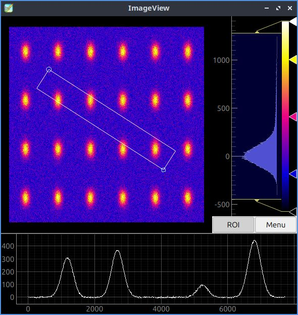

# Working with epicsdev.imagegen

Start epicsdev.imagegen for image generation with 10000*1000 16-bit pixels:
```bash
python -m epicsdev.imagegen -c -gr -s10000,1000
```

Start python interpreter in another terminal:
```python
from p4p.client.thread import Context
import pyqtgraph as pg
iface = Context('pva')
imageView = pg.image(iface.get('image0:image').T, scale=(10,1))
def show():
     imageView.setImage(iface.get('image0:image').T, scale=(10,1))

iface.put('image0:blobSigmaY',400); show()
iface.put('image0:blobSigmaX',20); show()
iface.put('image0:nBlobsX',6); show()
iface.put('image0:noiseLevel',100); show()
```
Click ROI and position the region of interest.
Click Color gradient and select 'flame'.

Monitoring example:
```python
def cb(value):
     #print(f'value: {type(value),value}')
     imageView.setImage(value.T, scale=(10,1))

subscribtion = iface.monitor('image0:image',cb)

# Now the image will be redrawn if its parameters gets changed
iface.put('image0:gridScaleX', .5)
iface.put('image0:gridScaleX', 1)
```
# animation, controlled from separate process
In another terminal start python interpreter with following code:
```python
import time, numpy as np
from p4p.client.thread import Context
iface = Context('pva')

oneTo0 = 1 - np.linspace(0,1,11)
scales = np.append(oneTo0[:-1], np.flip(oneTo0)[2:])
for scale in scales:
    iface.put('image0:gridScaleX',scale)
    time.sleep(.1)
```

